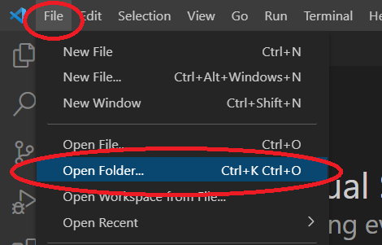
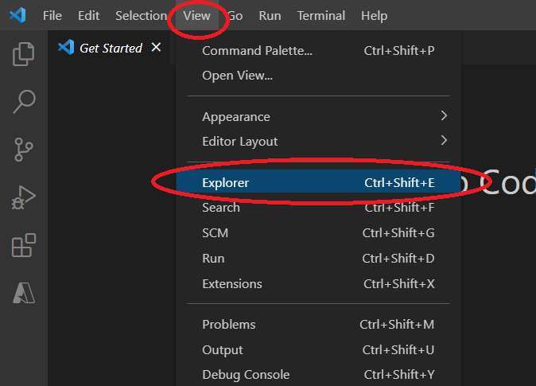
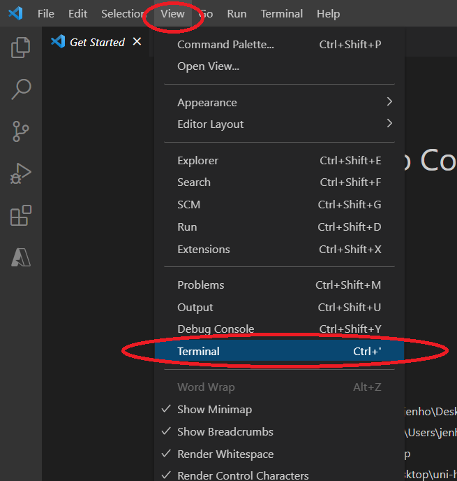
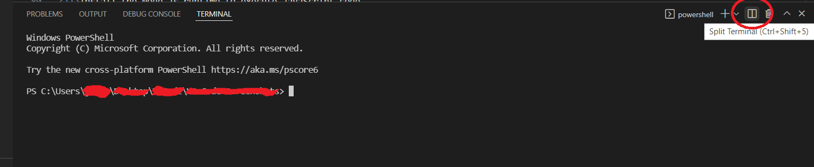
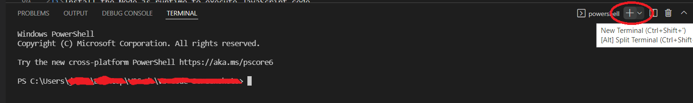

URL for Documentation Edits: https://code.visualstudio.com/docs/introvideos/codeediting

Current Documentation:

<h2 id="_video-outline" data-needslink="_video-outline">Video outline</h2>
<ul>
<li>Open a folder.
<ul>
<li><strong>File</strong> &gt; <strong>Open Folder</strong> (Ctrl+K Ctrl+O)</li>
</ul>
</li>
<li>Use File Explorer to view the folder's files and subfolders.
<ul>
<li><strong>View</strong> &gt; <strong>Explorer</strong> (⇧⌘E (Windows, Linux Ctrl+Shift+E))</li>
</ul>
</li>
<li>Install the Node.js runtime to execute JavaScript code.
<ul>
<li>Find Node.js for your platform at <a href="https://nodejs.org" class="external-link" target="_blank">https://nodejs.org</a></li>
</ul>
</li>
<li>Check your Node.js installation.
<ul>
<li>From a terminal or command prompt, type <code>node --version</code></li>
</ul>
</li>
<li>Create new file.
<ul>
<li><strong>File</strong> &gt; <strong>New File</strong> (⌘N (Windows, Linux Ctrl+N))</li>
</ul>
</li>
<li>Create a simple &quot;Hello world&quot; console application called <code>app.js</code>.</li>
<li>IntelliSense provides suggestions as you type.</li>
<li>Automatically format the source code.
<ul>
<li><strong>Format Document</strong> command (⇧⌥F (Windows Shift+Alt+F, Linux Ctrl+Shift+I))</li>
</ul>
</li>
<li>Turn on Auto Save.
<ul>
<li><strong>File</strong> &gt; <strong>Auto Save</strong></li>
</ul>
</li>
<li>Display the Integrated Terminal.
<ul>
<li><strong>View</strong> &gt; <strong>Terminal</strong> (⌃` (Windows, Linux Ctrl+`))</li>
</ul>
</li>
<li>Split the terminal.
<ul>
<li><strong>Split Terminal</strong> (⌘\ (Windows, Linux Ctrl+Shift+5))</li>
</ul>
</li>
<li>Create new terminal.
<ul>
<li><strong>Create New Terminal</strong> (⌃⇧` (Windows, Linux Ctrl+Shift+`))</li>
</ul>
</li>
<li>Run the application.
<ul>
<li>From the Integrated Terminal, type <code>node app.js</code></li>
</ul>
</li>
</ul>

Edited Documentation:

<h2 id="_video-outline" data-needslink="_video-outline">Video outline</h2>
<ul>
<li>Open a folder.
<ul>
<li><strong>File</strong> &gt; <strong>Open Folder</strong> (Ctrl+K Ctrl+O)</li>
</ul>
</li> 
  
<li>Use File Explorer to view the folder's files and subfolders.
<ul>
<li><strong>View</strong> &gt; <strong>Explorer</strong> (⇧⌘E (Windows, Linux Ctrl+Shift+E))</li>
</ul>
</li> 
  
<li>Install the Node.js runtime to execute JavaScript code.
<ul>
<li>Find Node.js for your platform at <a href="https://nodejs.org" class="external-link" target="_blank">https://nodejs.org</a></li>
</ul>
</li>
<li>Check your Node.js installation.
<ul>
<li>From a terminal or command prompt, type <code>node --version</code></li>
</ul>
</li>
<li>Create new file.
<ul>
<li><strong>File</strong> &gt; <strong>New File</strong> (⌘N (Windows, Linux Ctrl+N))</li>
</ul>
</li> 
  
<li>Create a simple &quot;Hello world&quot; console application called <code>app.js</code>.</li>
<li>IntelliSense provides suggestions as you type.</li>
<li>Automatically format the source code.
<ul>
<li><strong>Format Document</strong> command (⇧⌥F (Windows Shift+Alt+F, Linux Ctrl+Shift+I))</li>
</ul>
</li>
<li>Turn on Auto Save.
<ul>
<li><strong>File</strong> &gt; <strong>Auto Save</strong></li>
</ul>
</li> 
  
<li>Display the Integrated Terminal.
<ul>
<li><strong>View</strong> &gt; <strong>Terminal</strong> (⌃` (Windows, Linux Ctrl+`))</li>
</ul>
</li> 
  
<li>Split the terminal.
<ul>
<li><strong>Split Terminal</strong> (⌘\ (Windows, Linux Ctrl+Shift+5))</li>
</ul>
</li> 
  
<li>Create new terminal.
<ul>
<li><strong>Create New Terminal</strong> (⌃⇧` (Windows, Linux Ctrl+Shift+`))</li>
</ul>
</li> 

<li>Run the application.
<ul>
<li>From the Integrated Terminal, type <code>node app.js</code></li>
</ul>
</li>
</ul>