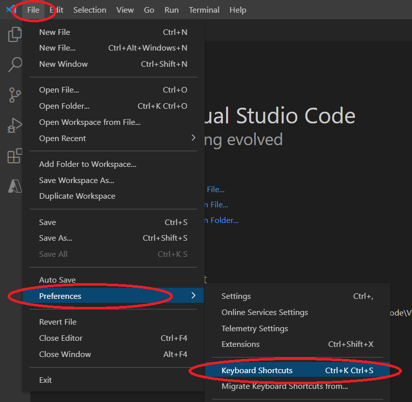
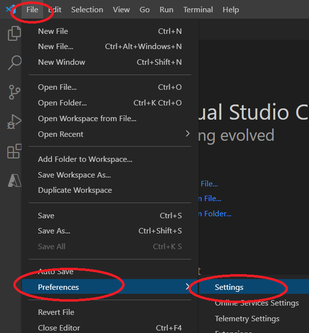

URL for Documentation Edits: https://code.visualstudio.com/docs/introvideos/customize

Current Documentation:

<h2 id="_video-outline" data-needslink="_video-outline">Video outline</h2>
<ul>
<li>Find a keyboard shortcut in the Command Palette</li>
<li>Learn about common keyboard shortcuts</li>
<li>Change a keyboard shortcut using the keyboard shortcut editor</li>
<li>Use a JSON file to customize keyboard shortcuts</li>
<li>Learn about keyboard shortcut extensions</li>
<li>Customize your settings using the settings editor</li>
<li>Use a JSON file to customize settings</li>
<li>Configure language specific settings</li>
</ul>

Edited Documentation:

<h2 id="_video-outline" data-needslink="_video-outline">Video outline</h2>
<ul>
<li>Find a keyboard shortcut in the Command Palette</li> 
  
<li>Learn about common keyboard shortcuts</li>
<li>Change a keyboard shortcut using the keyboard shortcut editor</li> 
  
<li>Use a JSON file to customize keyboard shortcuts</li>
<li>Learn about keyboard shortcut extensions</li>
<li>Customize your settings using the settings editor</li> 

<li>Use a JSON file to customize settings</li>
<li>Configure language specific settings</li>
</ul>