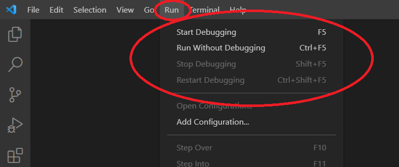

URL for Documentation Edits: https://code.visualstudio.com/docs/introvideos/debugging

Current Documentation:

<h2 id="_video-outline" data-needslink="_video-outline">Video outline</h2>
<ul>
<li>Debugging that &quot;just works&quot;.</li>
<li>Run a sample Node.js app.</li>
<li>Use a <code>launch.json</code> configuration file.</li>
<li>Single file debugging.</li>
<li>Set a breakpoint.</li>
</ul>

Edited Documentation:

<h2 id="_video-outline" data-needslink="_video-outline">Video outline</h2>
<ul>
<li>Debugging that &quot;just works&quot;.</li>
<li>Run a sample Node.js app.</li>
<li>Use a <code>launch.json</code> configuration file.</li>
<li>Single file debugging.</li> 
  
<li>Set a breakpoint.</li> 
  
</ul>