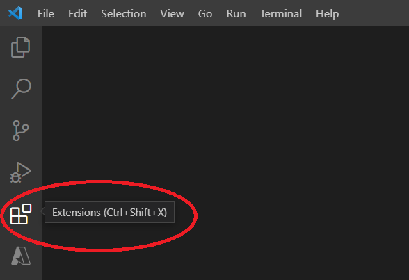

URL for Documentation Edits: https://code.visualstudio.com/docs/introvideos/extend

Current Documentation:

<h2 id="_video-outline" data-needslink="_video-outline">Video outline</h2>
<ul>
<li>Find extensions to install using the Extensions view.</li>
<li>Install an extension from the VS Code Extension Marketplace.</li>
<li>See what features are added via the <strong>Features Contributions</strong> tab or Command Palette (⇧⌘P (Windows, Linux Ctrl+Shift+P)).</li>
<li>See recommendations for other extensions.</li>
</ul>

Edited Documentation:

<h2 id="_video-outline" data-needslink="_video-outline">Video outline</h2>
<ul>
<li>Find extensions to install using the Extensions view.</li> 
  
<li>Install an extension from the VS Code Extension Marketplace.</li>
<li>See what features are added via the <strong>Features Contributions</strong> tab or Command Palette (⇧⌘P (Windows, Linux Ctrl+Shift+P)).</li> 
  
<li>See recommendations for other extensions.</li>
</ul>