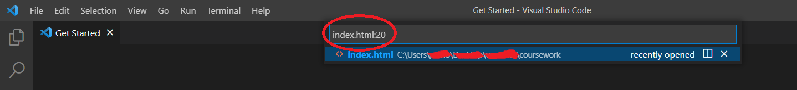
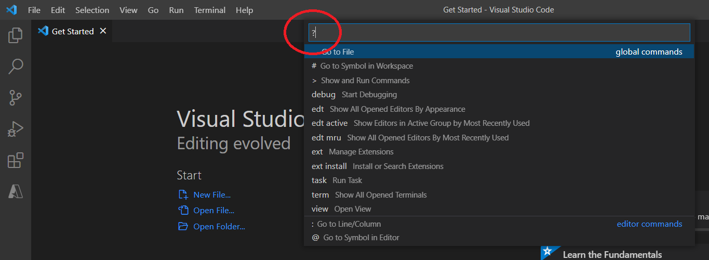
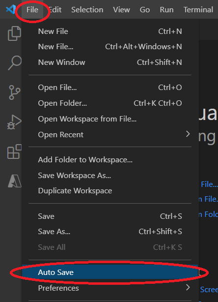
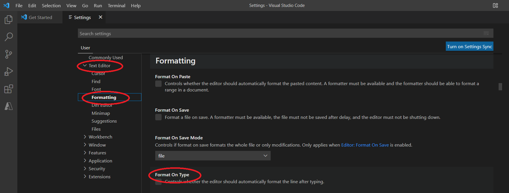
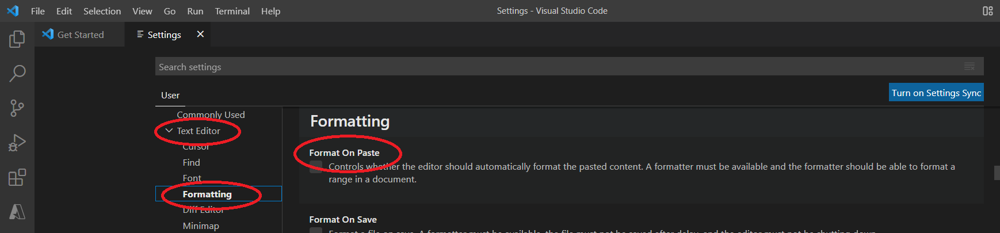

URL for Documentation Edits: https://code.visualstudio.com/docs/introvideos/productivity

Current Documentation:

<h2 id="_video-outline" data-needslink="_video-outline">Video outline</h2>
<ul>
<li>Find features and keyboard shortcuts in the Command Palette
<ul>
<li><strong>View</strong> &gt; <strong>Command Palette...</strong> (⇧⌘P (Windows, Linux Ctrl+Shift+P))</li>
</ul>
</li>
<li>Quick Open recent files or search by filename
<ul>
<li>⌘P (Windows, Linux Ctrl+P) to show the Quick Open dropdown</li>
</ul>
</li>
<li>Go to Line in a file
<ul>
<li>type <code>filename:line number</code></li>
</ul>
</li>
<li>Go to Symbol in a file
<ul>
<li>type <code>filename@symbol name</code></li>
</ul>
</li>
<li>View Quick Open options
<ul>
<li>type ?</li>
</ul>
</li>
<li>Quick Open multiple files
<ul>
<li>press Right Arrow to open the selected file but leave the dropdown available</li>
</ul>
</li>
<li>Multi-cursor selection
<ul>
<li>Alt+Click on Windows and Linux, Option+Click on macOS to add a new cursor</li>
<li>⌥⌘↑ (Windows Ctrl+Alt+Up, Linux Shift+Alt+Up) ⌥⌘↓ (Windows Ctrl+Alt+Down, Linux Shift+Alt+Down) to add a new cursor above or below the current position</li>
<li>⇧⌘L (Windows, Linux Ctrl+Shift+L) to add cursors to all matches of the current selection</li>
</ul>
</li>
<li>Auto Save changes
<ul>
<li><strong>File</strong> &gt; <strong>Auto Save</strong></li>
</ul>
</li>
<li>Open the Settings editor
<ul>
<li><strong>File</strong> &gt; <strong>Preferences</strong> &gt; <strong>Settings</strong> (⌘, (Windows, Linux Ctrl+,))</li>
<li><strong>Code</strong> &gt; <strong>Preferences</strong> &gt; <strong>Settings</strong> on macOS</li>
</ul>
</li>
<li>Set Format On Type
<ul>
<li>check <strong>Editor: Format on Type</strong></li>
</ul>
</li>
<li>Set Format On Paste
<ul>
<li>check <strong>Editor: Format on Paste</strong></li>
</ul>
</li>
<li>IntelliSense smart code completions
<ul>
<li>trigger IntelliSense with ⌃Space (Windows, Linux Ctrl+Space)</li>
</ul>
</li>
</ul>

Edited Documentation:

<h2 id="_video-outline" data-needslink="_video-outline">Video outline</h2>
<ul>
<li>Find features and keyboard shortcuts in the Command Palette
<ul>
<li><strong>View</strong> &gt; <strong>Command Palette...</strong> (⇧⌘P (Windows, Linux Ctrl+Shift+P))</li>
</ul>
</li> 
  
<li>Quick Open recent files or search by filename
<ul>
<li>⌘P (Windows, Linux Ctrl+P) to show the Quick Open dropdown</li>
</ul>
</li> 
  
<li>Go to Line in a file
<ul>
<li>type <code>filename:line number</code></li>
</ul>
</li> 
  
<li>Go to Symbol in a file
<ul>
<li>type <code>filename@symbol name</code></li>
</ul>
</li> 
  
<li>View Quick Open options
<ul>
<li>type ?</li>
</ul>
</li> 
  
<li>Quick Open multiple files
<ul>
<li>press Right Arrow to open the selected file but leave the dropdown available</li>
</ul>
</li>
<li>Multi-cursor selection
<ul>
<li>Alt+Click on Windows and Linux, Option+Click on macOS to add a new cursor</li>
<li>⌥⌘↑ (Windows Ctrl+Alt+Up, Linux Shift+Alt+Up) ⌥⌘↓ (Windows Ctrl+Alt+Down, Linux Shift+Alt+Down) to add a new cursor above or below the current position</li>
<li>⇧⌘L (Windows, Linux Ctrl+Shift+L) to add cursors to all matches of the current selection</li>
</ul>
</li>
<li>Auto Save changes
<ul>
<li><strong>File</strong> &gt; <strong>Auto Save</strong></li>
</ul>
</li> 
  
<li>Open the Settings editor
<ul>
<li><strong>File</strong> &gt; <strong>Preferences</strong> &gt; <strong>Settings</strong> (⌘, (Windows, Linux Ctrl+,))</li>
<li><strong>Code</strong> &gt; <strong>Preferences</strong> &gt; <strong>Settings</strong> on macOS</li>
</ul>
</li> 
  
<li>Set Format On Type
<ul>
<li>check <strong>Editor: Format on Type</strong></li>
</ul>
</li> 
  
<li>Set Format On Paste
<ul>
<li>check <strong>Editor: Format on Paste</strong></li>
</ul>
</li> 
  
<li>IntelliSense smart code completions
<ul>
<li>trigger IntelliSense with ⌃Space (Windows, Linux Ctrl+Space)</li>
</ul>
</li>
</ul>