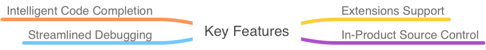

# What is VS CODE

Visual Studio Code is a lightweight but powerful source code editor which runs on your desktop and is available for Windows, macOS and Linux. It comes with built-in support for JavaScript, TypeScript and Node.js and has a rich ecosystem of extensions for other languages (such as C++, C#, Java, Python, PHP, Go) and runtimes (such as .NET and Unity). Begin your journey with VS Code with these [introductory videos](https://code.visualstudio.com/docs/introvideos/overview).

## Visual Studio Code in Action

### Intelligent Code Completion

Code smarter with [IntelliSense](https://code.visualstudio.com/docs/editor/intellisense) - completions for variables, methods, and imported modules.

### Streamlined Debugging

Print debugging is a thing of the past. [Debug](https://code.visualstudio.com/docs/editor/debugging) in VS Code with your terminal tools.

### In-Product Source Control

Speed up your release cycle with [SCM support](https://code.visualstudio.com/docs/editor/versioncontrol) inside your editor, including rich Git integration.

## Top Extensions

Enable additional languages, themes, debuggers, commands, and more. VS Code's growing community shares their secret sauce to improve your workflow.

[

IntelliSense (Pylance), Linting, Debugging (multi-threaded, remote), Jupyter Notebooks, code formatting, refactoring, unit tests, and more.

](https://marketplace.visualstudio.com/items?itemName=ms-python.python)[

Jupyter notebook support, interactive programming and computing that supports Intellisense, debugging and more.

](https://marketplace.visualstudio.com/items?itemName=ms-toolsai.jupyter)[

C/C++ IntelliSense, debugging, and code browsing.

](https://marketplace.visualstudio.com/items?itemName=ms-vscode.cpptools)[

A performant, feature-rich language server for Python in VS Code

](https://marketplace.visualstudio.com/items?itemName=ms-python.vscode-pylance)[

Integrates ESLint JavaScript into VS Code.

](https://marketplace.visualstudio.com/items?itemName=dbaeumer.vscode-eslint)[

Launch a development local Server with live reload feature for static & dynamic pages

](https://marketplace.visualstudio.com/items?itemName=ritwickdey.LiveServer)[

Prettier - Code formatter

Code formatter using prettier

](https://marketplace.visualstudio.com/items?itemName=esbenp.prettier-vscode)[

Visual Studio IntelliCode

16.2M

VisualStudioExptTeam

](https://marketplace.visualstudio.com/items?itemName=VisualStudioExptTeam.vscodeintellicode)

[See more in the Marketplace](https://marketplace.visualstudio.com/vscode)

## First Steps

To get the most out of Visual Studio Code, start by reviewing a few introductory topics:

[Intro Videos](https://code.visualstudio.com/docs/getstarted/introvideos) - Begin your journey with VS Code through these introductory videos.

[Setup](https://code.visualstudio.com/docs/setup/setup-overview) - Install VS Code for your platform and configure the tool set for your development needs.

[User Interface](https://code.visualstudio.com/docs/getstarted/userinterface) - Introduction to the basic UI, commands, and features of the VS Code editor.

[Settings](https://code.visualstudio.com/docs/getstarted/settings) - Customize VS Code for how you like to work.

[Languages](https://code.visualstudio.com/docs/languages/overview) - Learn about VS Code's support for your favorite programming languages.

[Node.js](https://code.visualstudio.com/docs/nodejs/nodejs-tutorial) - This tutorial gets you quickly running and debugging a Node.js web app.

[Tips and Tricks](https://code.visualstudio.com/docs/getstarted/tips-and-tricks) - Jump right in with Tips and Tricks to become a VS Code power user.

[Azure](https://code.visualstudio.com/docs/azure/extensions) - VS Code is great for deploying your web applications to the cloud.

[Extension API](https://code.visualstudio.com/api) - Learn how to write a VS Code extension.

[Why VS Code?](https://code.visualstudio.com/docs/editor/whyvscode) - Read about the design philosophy and architecture of VS Code.

## Keyboard Shortcuts

Increase your productivity with VS Code's keyboard shortcuts.

## Downloads

[Download VS Code](https://code.visualstudio.com/download) - Quickly find the appropriate install for your platform (Windows, macOS and Linux)

## Privacy

By default, VS Code auto-updates to new versions, and collects usage data and crash report information. You may opt out of these defaults by disabling them as instructed below:

