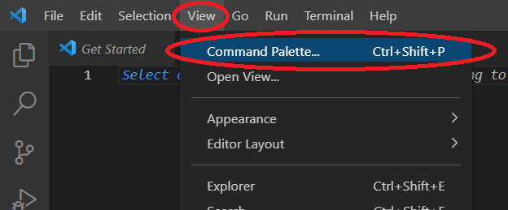
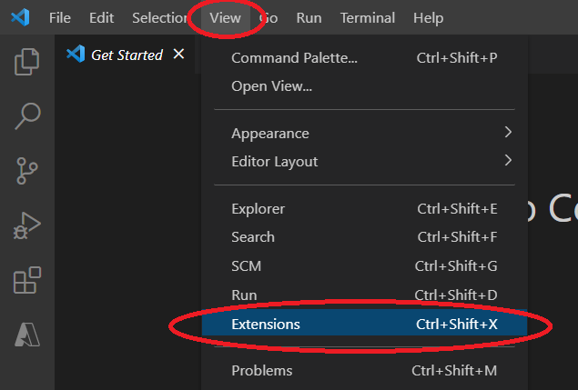
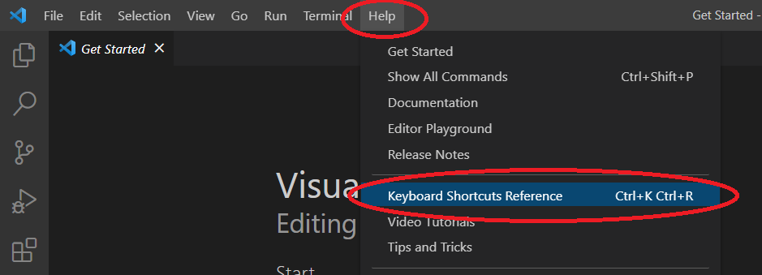
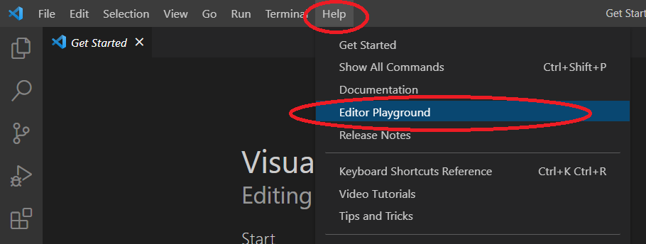

URL for Documentation Edits: https://code.visualstudio.com/docs/introvideos/basics

Current Documentation:

<h2 id="_video-outline" data-needslink="_video-outline">Video outline</h2>
<ul>
<li>Download and install VS Code.
<ul>
<li>From <a href="https://code.visualstudio.com/download">https://code.visualstudio.com/download</a></li>
</ul>
</li>
<li>Create a new file.
<ul>
<li><strong>File</strong> &gt; <strong>New File</strong> (⌘N (Windows, Linux Ctrl+N))</li>
</ul>
</li>
<li>Save a file.
<ul>
<li><strong>File</strong> &gt; <strong>Save</strong> (⌘S (Windows, Linux Ctrl+S))</li>
</ul>
</li>
<li>Open the Command Palette.
<ul>
<li><strong>View</strong> &gt; <strong>Command Palette...</strong> (⇧⌘P (Windows, Linux Ctrl+Shift+P))</li>
</ul>
</li>
<li>See an overview of the user interface.
<ul>
<li><strong>Help: User Interface Overview</strong> in the Command Palette.</li>
</ul>
</li>
<li>Install support for your favorite programming language from the Extensions view.
<ul>
<li><strong>View</strong> &gt; <strong>Extensions</strong> (⇧⌘X (Windows, Linux Ctrl+Shift+X))</li>
</ul>
</li>
<li>Change your keyboard shortcuts and easily migrate from other editors using keymap extensions.
<ul>
<li><strong>File</strong> &gt; <strong>Preferences</strong> &gt; <strong>Migrate Keyboard Shortcuts from...</strong></li>
<li><strong>Code</strong> &gt; <strong>Preferences</strong> &gt; <strong>Migrate Keyboard Shortcuts from...</strong> on macOS</li>
</ul>
</li>
<li>Open the Keyboard Shortcuts editor.
<ul>
<li><strong>File</strong> &gt; <strong>Preferences</strong> &gt; <strong>Keyboard Shortcuts</strong> (⌘K ⌘S (Windows, Linux Ctrl+K Ctrl+S))</li>
<li><strong>Code</strong> &gt; <strong>Preferences</strong> &gt; <strong>Keyboard Shortcuts</strong> on macOS</li>
</ul>
</li>
<li>Printable keyboard cheat sheet.
<ul>
<li><strong>Help</strong> &gt;  <strong>Keyboard Shortcuts Reference</strong> (⌘K ⌘R (Windows, Linux Ctrl+K Ctrl+R))</li>
</ul>
</li>
<li>Customize your editor with color themes.
<ul>
<li><strong>File</strong> &gt; <strong>Preferences</strong> &gt; <strong>Color Theme</strong> (⌘K ⌘T (Windows, Linux Ctrl+K Ctrl+T))</li>
<li><strong>Code</strong> &gt; <strong>Preferences</strong> &gt; <strong>Color Theme</strong> on macOS</li>
</ul>
</li>
<li>Show all commands.
<ul>
<li><strong>Help</strong> &gt; <strong>Show All Commands</strong> (⇧⌘P (Windows, Linux Ctrl+Shift+P))</li>
</ul>
</li>
<li>Explore VS Code features in the <strong>Interactive Editor Playground</strong>.
<ul>
<li><strong>Help</strong> &gt; <strong>Editor Playground</strong></li>
</ul>
</li>
</ul>

Edited Documentation:

<h2 id="_video-outline" data-needslink="_video-outline">Video outline</h2>
<ul>
<li>Download and install VS Code.
<ul>
<li>From <a href="https://code.visualstudio.com/download">https://code.visualstudio.com/download</a></li>
</ul>
</li>
<li>Create a new file.
<ul>
<li><strong>File</strong> &gt; <strong>New File</strong> (⌘N (Windows, Linux Ctrl+N))</li>
</ul>
</li> 
  
<li>Save a file.
<ul>
<li><strong>File</strong> &gt; <strong>Save</strong> (⌘S (Windows, Linux Ctrl+S))</li>
</ul>
</li> 
  
<li>Open the Command Palette.
<ul>
<li><strong>View</strong> &gt; <strong>Command Palette...</strong> (⇧⌘P (Windows, Linux Ctrl+Shift+P))</li>
</ul>
</li> 
  
<li>See an overview of the user interface.
<ul>
<li><strong>Help: User Interface Overview</strong> in the Command Palette.</li>
</ul>
</li> 
  
<li>Install support for your favorite programming language from the Extensions view.
<ul>
<li><strong>View</strong> &gt; <strong>Extensions</strong> (⇧⌘X (Windows, Linux Ctrl+Shift+X))</li>
</ul>
</li> 
  
<li>Change your keyboard shortcuts and easily migrate from other editors using keymap extensions.
<ul>
<li><strong>File</strong> &gt; <strong>Preferences</strong> &gt; <strong>Migrate Keyboard Shortcuts from...</strong></li>
<li><strong>Code</strong> &gt; <strong>Preferences</strong> &gt; <strong>Migrate Keyboard Shortcuts from...</strong> on macOS</li>
</ul>
</li> 
  
<li>Open the Keyboard Shortcuts editor.
<ul>
<li><strong>File</strong> &gt; <strong>Preferences</strong> &gt; <strong>Keyboard Shortcuts</strong> (⌘K ⌘S (Windows, Linux Ctrl+K Ctrl+S))</li>
<li><strong>Code</strong> &gt; <strong>Preferences</strong> &gt; <strong>Keyboard Shortcuts</strong> on macOS</li>
</ul>
</li> 
  
<li>Printable keyboard cheat sheet.
<ul>
<li><strong>Help</strong> &gt;  <strong>Keyboard Shortcuts Reference</strong> (⌘K ⌘R (Windows, Linux Ctrl+K Ctrl+R))</li>
</ul>
</li> 
  
<li>Customize your editor with color themes.
<ul>
<li><strong>File</strong> &gt; <strong>Preferences</strong> &gt; <strong>Color Theme</strong> (⌘K ⌘T (Windows, Linux Ctrl+K Ctrl+T))</li>
<li><strong>Code</strong> &gt; <strong>Preferences</strong> &gt; <strong>Color Theme</strong> on macOS</li>
</ul>
</li> 
  
<li>Show all commands.
<ul>
<li><strong>Help</strong> &gt; <strong>Show All Commands</strong> (⇧⌘P (Windows, Linux Ctrl+Shift+P))</li>
</ul>
</li> 
  
<li>Explore VS Code features in the <strong>Interactive Editor Playground</strong>.
<ul>
<li><strong>Help</strong> &gt; <strong>Editor Playground</strong></li>
</ul>
</li> 

</ul>