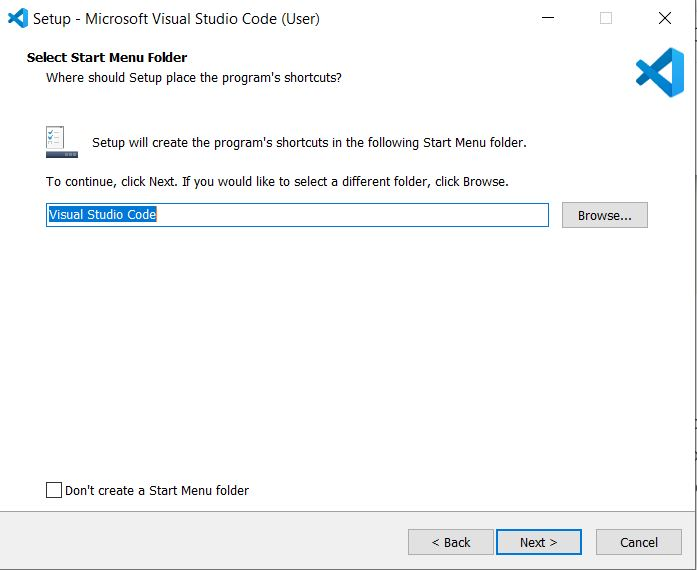
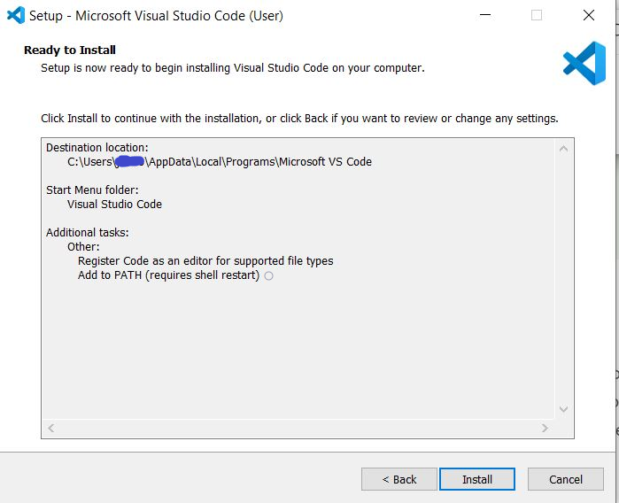

URL for Documentation Edits: https://code.visualstudio.com/docs/setup/windows

Current Documentation:

Installation
1.	Download the Visual Studio Code installer for Windows.
2.	Once it is downloaded, run the installer (VSCodeUserSetup-{version}.exe). This will only take a minute.
3.	By default, VS Code is installed under C:\Users\{Username}\AppData\Local\Programs\Microsoft VS Code.

Edited Documentation:

Installation
1.	Download the Visual Studio Code installer for Windows.
2.	Once it is downloaded, run the installer (VSCodeUserSetup-{version}.exe). This will only take a minute.
3.	You may receive a security warning. This is to ensure you know that the files you are downloading from the internet are safe to open and do not contain any malicious software. Click “Run”.
   

4.	Next, you will need to agree to the License Agreement. It contains important legal information concerning your use of Visual Studio Code. Read through the agreement, and then choose “I accept the agreement”. Then, click “Next”.
   

5.	In this step, you should select the folder you want the Visual Studio Code files to be installed into. If you want to change from the default, click the “Browse” button and select a folder from the File Explorer that opens. By default, VS Code is installed under C:\Users{Username}\AppData\Local\Programs\Microsoft VS Code. Make note of the required free disk space at the bottom of the installer and ensure that you have enough for the download.
   

6.	Now, you should select the folder you want the Start Menu shortcut to be installed into. The Start Menu can be accessed by clicking on the Windows logo in your taskbar, pressing the Windows button on your keyboard, or by pressing Ctrl + Esc. If you would rather not have a Start Menu shortcut, then click the checkbox at the bottom of the installer before clicking “Next”.
   

7.	Next, you should select the additional tasks you want to be performed while the installation occurs. These are all optional.
<ul>
<li>“Create a desktop icon” – This will create an icon for VS Code on your computer desktop for ease of access.</li>
<li>“Add “Open with Code” action to Windows Explorer file context menu” – This will allow you to right-click on a file in Windows Explorer and open it with Visual Studio Code.</li>
<li>“Add “Open with Code” action to Windows Explorer directory context menu.” – This will allow you to right-click on a folder in Windows Explorer and open it with Visual Studio Code.</li>
<li>“Register Code as an editor for supported file types” – This will allow you to choose Visual Studio Code for supported files. Warning: Selecting this option will reset all default editors for all supported file types.</li>
<li>“Add to PATH (requires shell restart)” – PATH is a string comprised of directory paths. These paths will be searched every time you try to run a program. Adding Visual Studio Code to your PATH means that you can type ‘code (filename)’ into your Command Prompt to open that file in Visual Studio Code. You will be required to restart your computer for this to take effect.</li>
</ul>
   

8.	Now you will see the “Ready to Install” screen. You can check over the selections you made on the previous screens and use the “Back” button if you want to change anything. Otherwise, click “Install” to start the Visual Studio Code installation.
   

9.	 The installation may take a few minutes. After it had finished, you will see the following screen to let you know that the installation is complete.
   

